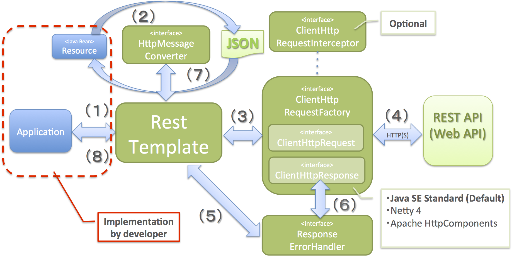

RESTクライアント（HTTPクライアント）
================================================================================

.. only:: html

 .. contents:: 目次
    :depth: 3
    :local:

.. _RestClientOverview:

Overview
--------------------------------------------------------------------------------

本節では、Spring Frameworkが提供する\ ``org.springframework.web.client.RestTemplate``\ を使用してRESTful Web Service(REST API)を呼び出す実装方法について説明する。

.. _RestClientOverviewRestTemplate:

``RestTemplate`` とは
^^^^^^^^^^^^^^^^^^^^^^^^^^^^^^^^^^^^^^^^^^^^^^^^^^^^^^^^^^^^^^^^^^^^^^^^^^^^^^^^

``RestTemplate``\ は、REST API(Web API)を呼び出すためのメソッドを提供するクラスであり、
Spring Frameworkが提供するHTTPクライアントである。

具体的な実装方法の説明を行う前に、\ ``RestTemplate``\ がどのようにREST API(Web API)にアクセスしているかを説明する。

.. tabularcolumns:: |p{0.10\linewidth}|p{0.20\linewidth}|p{0.60\linewidth}|
.. list-table::
    :header-rows: 1
    :widths: 10 20 60

    * - 項番
      - コンポーネント
      - 説明
    * - | (1)
      - | アプリケーション
      - | \ ``RestTemplate``\ のメソッドを呼び出して、REST API(Web API)の呼び出し依頼を行う。
    * - | (2)
      - | \ ``RestTemplate``\
      - | \ ``HttpMessageConverter``\ を使用して、Javaオブジェクトをリクエストボディに設定する電文(JSON等)に変換する。
    * - | (3)
      - |
      - | \ ``ClientHttpRequestFactory``\ から\ ``ClientHttpRequest``\ を取得して、電文(JSON等)の送信依頼を行う。
    * - | (4)
      - | \ ``ClientHttpRequest``\
      - | 電文(JSON等)をリクエストボディに設定して、REST API(Web API)にHTTP経由でリクエストを行う。
    * - | (5)
      - | \ ``RestTemplate``\
      - | \ ``ResponseErrorHandler``\ を使用して、HTTP通信のエラー判定及びエラー処理を行う。
    * - | (6)
      - | \ ``ResponseErrorHandler``\
      - | \ ``ClientHttpResponse``\ からレスポンスデータを取得して、エラー判定及びエラー処理を行う。
    * - | (7)
      - | \ ``RestTemplate``\
      - | \ ``HttpMessageConverter``\ を使用して、レスポンスボディに設定されている電文(JSON等)をJavaオブジェクトに変換する。
    * - | (8)
      - |
      - | REST API(Web API)の呼び出し結果(Javaオブジェクト)をアプリケーションへ返却する。

.. note:: **非同期処理への対応**

    REST APIからの応答を別スレッドで処理したい場合(非同期で処理したい場合)は、
    \ ``RestTemplate``\ の代わりに\ ``org.springframework.web.client.AsyncRestTemplate``\ を使用すればよい。
    非同期処理の実装例については、:ref:`RestClientAsync` を参照されたい。

.. _RestClientOverviewHttpMessageConverter:

``HttpMessageConverter``
""""""""""""""""""""""""""""""""""""""""""""""""""""""""""""""""""""""""""""""""

\ ``org.springframework.http.converter.HttpMessageConverter``\は、アプリケーションで扱うJavaオブジェクトとサーバと通信するための電文(JSON等)を相互に変換するためのインタフェースである。

\ ``RestTemplate``\ を使用した場合、デフォルトで以下の\ ``HttpMessageConverter``\ の実装クラスが登録される。

.. tabularcolumns:: |p{0.05\linewidth}|p{0.25\linewidth}|p{0.55\linewidth}|p{0.15\linewidth}|
.. list-table:: **デフォルトで登録されるHttpMessageConverter**
    :header-rows: 1
    :widths: 5 25 55 15

    * - 項番
      - クラス名
      - 説明
      - サポート型
    * - | (1)
      - | ``org.springframework.http.converter.``
        | ``ByteArrayHttpMessageConverter``
      - | 「HTTPボディ(テキスト or バイナリデータ)⇔バイト配列」変換用のクラス。
        | デフォルトですべてのメディアタイプ(\ ``*/*``\)をサポートする。
      - | ``byte[]``
    * - | (2)
      - | ``org.springframework.http.converter.``
        | ``StringHttpMessageConverter``
      - | 「HTTPボディ(テキスト)⇔文字列」変換用のクラス。
        | デフォルトですべてのテキストメディアタイプ(\ ``text/*``\ )をサポートする。
      - | ``String``
    * - | (3)
      - | ``org.springframework.http.converter.``
        | ``ResourceHttpMessageConverter``
      - | 「HTTPボディ(バイナリデータ)⇔Springのリソースオブジェクト」変換用のクラス。
        | デフォルトですべてのメディアタイプ(\ ``*/*``\ )をサポートする。
      - | ``Resource`` [#p1]_
    * - | (4)
      - | ``org.springframework.http.converter.xml.``
        | ``SourceHttpMessageConverter``
      - | 「HTTPボディ(XML)⇔XMLソースオブジェクト」変換用のクラス。
        | デフォルトでXML用のメディアタイプ(\ ``text/xml``\ ,\ ``application/xml``\ ,\ ``application/*-xml``\ )をサポートする。
      - | ``Source`` [#p2]_
    * - | (5)
      - | ``org.springframework.http.converter.support.``
        | ``AllEncompassingFormHttpMessageConverter``
      - | 「HTTPボディ⇔\ ``MultiValueMap``\ オブジェクト」変換用のクラス。
        | \ ``FormHttpMessageConverter``\ の拡張クラスで、multipartのパートデータとしてXMLとJSONへの変換がサポートされている。
        | デフォルトでフォームデータ用のメディアタイプ(\ ``application/x-www-form-urlencoded``\ ,\ ``multipart/form-data``\ )をサポートする。

        * メディアタイプが\ ``application/x-www-form-urlencoded``\ の場合、\ ``MultiValueMap<String, String>``\ として読込/書込される。
        * メディアタイプが\ ``multipart/form-data``\ の場合、\ ``MultiValueMap<String, Object>``\ として書込され、\ ``Object``\ は\ ``AllEncompassingFormHttpMessageConverter``\ 内に別途設定される\ ``HttpMessageConveter``\ で変換される。

        | デフォルトで登録されるパートデータ変換用の\ ``HttpMessageConveter``\ は、`AllEncompassingFormHttpMessageConverter <https://github.com/spring-projects/spring-framework/blob/4.1.x/spring-web/src/main/java/org/springframework/http/converter/support/AllEncompassingFormHttpMessageConverter.java>`_\
          と `FormHttpMessageConverter <https://github.com/spring-projects/spring-framework/blob/4.1.x/spring-web/src/main/java/org/springframework/http/converter/FormHttpMessageConverter.java>`_\ のソースを参照されたい。なお、任意の\ ``HttpMessageConverter``\ を登録することもできる。
      - | ``MultiValueMap`` [#p3]_

\

.. tabularcolumns:: |p{0.05\linewidth}|p{0.25\linewidth}|p{0.55\linewidth}|p{0.15\linewidth}|
.. list-table:: **依存ライブラリがクラスパス上に存在する場合に登録されるHttpMessageConverter**
    :header-rows: 1
    :widths: 5 25 55 15

    * - 項番
      - クラス名
      - 説明
      - サポート型
    * - | (6)
      - | ``org.springframework.http.converter.feed.``
        | ``AtomFeedHttpMessageConverter``
      - | 「HTTPボディ(Atom)⇔Atomフィードオブジェクト」変換用のクラス。
        | デフォルトでATOM用のメディアタイプ(\ ``application/atom+xml``\ )をサポートする。
        | (ROMEがクラスパスに存在する場合に登録される)
      - | ``Feed`` [#p4]_
    * - | (7)
      - | ``org.springframework.http.converter.feed.``
        | ``RssChannelHttpMessageConverter``
      - | 「HTTPボディ(RSS)⇔Rssチャネルオブジェクト」変換用のクラス。
        | デフォルトでRSS用のメディアタイプ(\ ``application/rss+xml``\ )をサポートする。
        | (ROMEがクラスパスに存在する場合に登録される)
      - | ``Channel`` [#p5]_
    * - | (8)
      - | ``org.springframework.http.converter.json.``
        | ``MappingJackson2HttpMessageConverter``
      - | 「HTTPボディ(JSON)⇔JavaBean」変換用のクラス。
        | デフォルトでJSON用のメディアタイプ(\ ``application/json``\ ,\ ``application/*+json``\ )をサポートする。
        | (Jackson2がクラスパスに存在する場合に登録される)
      - | ``Object`` (JavaBean)
        | ``Map``
    * - | (9)
      - | ``org.springframework.http.converter.xml.``
        | ``MappingJackson2XmlHttpMessageConverter``
      - | 「HTTPボディ(XML)⇔JavaBean」変換用のクラス。
        | デフォルトでXML用のメディアタイプ(\ ``text/xml``\ ,\ ``application/xml``\ ,\ ``application/*-xml``\ )をサポートする。
        | (Jackson-dataformat-xmlがクラスパスに存在する場合に登録される)
      - | ``Object`` (JavaBean)
        | ``Map``
    * - | (10)
      - | ``org.springframework.http.converter.xml.``
        | ``Jaxb2RootElementHttpMessageConverter``
      - | 「HTTPボディ(XML)⇔JavaBean」変換用のクラス。
        | デフォルトでXML用のメディアタイプ(\ ``text/xml``\ ,\ ``application/xml``\ ,\ ``application/*-xml``\ )をサポートする。
        | (JAXBがクラスパスに存在する場合に登録される)
      - | ``Object`` (JavaBean)
    * - | (11)
      - | ``org.springframework.http.converter.json.``
        | ``GsonHttpMessageConverter``
      - | 「HTTPボディ(JSON)⇔JavaBean」変換用のクラス。
        | デフォルトでJSON用のメディアタイプ(\ ``application/json``\ ,\ ``application/*+json``\ )をサポートする。
        | (Gsonがクラスパスに存在する場合に登録される)
      - | ``Object`` (JavaBean)
        | ``Map``

\

.. [#p1] \ ``org.springframework.core.io``\ パッケージのクラス
.. [#p2] \ ``javax.xml.transform``\ パッケージのクラス
.. [#p3] \ ``org.springframework.util``\ パッケージのクラス
.. [#p4] \ ``com.rometools.rome.feed.atom``\ パッケージのクラス
.. [#p5] \ ``com.rometools.rome.feed.rss``\ パッケージのクラス

.. _RestClientOverviewClientHttpRequestFactory:

``ClientHttpRequestFactory``
""""""""""""""""""""""""""""""""""""""""""""""""""""""""""""""""""""""""""""""""

\ ``RestTemplate``\ は、サーバとの通信処理を以下の３つのインタフェースの実装クラスに委譲することで実現している。

* ``org.springframework.http.client.ClientHttpRequestFactory``
* ``org.springframework.http.client.ClientHttpRequest``
* ``org.springframework.http.client.ClientHttpResponse``

この３つのインタフェースのうち、開発者が意識するのは\ ``ClientHttpRequestFactory``\ である。
\ ``ClientHttpRequestFactory``\ は、サーバとの通信処理を行うクラス(\ ``ClientHttpRequest``\ と \ ``ClientHttpResponse``\ インタフェースの実装クラス)を解決する役割を担っている。

なお、Spring Frameworkが提供している主な\ ``ClientHttpRequestFactory``\ の実装クラスは以下の通りである。

.. tabularcolumns:: |p{0.05\linewidth}|p{0.25\linewidth}|p{0.70\linewidth}|
.. list-table:: **Spring Frameworkが提供している主なClientHttpRequestFactoryの実装クラス**
   :header-rows: 1
   :widths: 5 25 70

   * - 項番
     - クラス名
     - 説明
   * - | (1)
     - | ``org.springframework.http.client.``
       | ``SimpleClientHttpRequestFactory``
     - | Java SE標準の `HttpURLConnection <https://docs.oracle.com/javase/8/docs/api/java/net/HttpURLConnection.html>`_\ のAPIを使用して通信処理(同期、非同期)を行うための実装クラス。(デフォルトで使用される実装クラス)
   * - | (2)
     - | ``org.springframework.http.client.``
       | ``Netty4ClientHttpRequestFactory``
     - | `Netty 4 <http://netty.io/>`_\ のAPIを使用して通信処理(同期、非同期)を行うための実装クラス。
   * - | (3)
     - | ``org.springframework.http.client.``
       | ``HttpComponentsClientHttpRequestFactory``
     - | `Apache HttpComponents HttpClient <http://hc.apache.org/httpcomponents-client-ga/>`_\ のAPIを使用して同期型の通信処理を行うための実装クラス。(HttpClient 4.3以上が必要)
   * - | (4)
     - | ``org.springframework.http.client.``
       | ``HttpComponentsAsyncClientHttpRequestFactory``
     - | `Apache HttpComponents HttpAsyncClient <http://hc.apache.org/httpcomponents-asyncclient-dev/>`_\ のAPIを使用して非同期型の通信処理を行うための実装クラス。(HttpAsyncClient 4.0以上が必要)

.. note:: **使用するClientHttpRequestFactoryの実装クラスについて**

    \ ``RestTemplate``\ が使用するデフォルト実装は\ ``SimpleClientHttpRequestFactory``\ であり、本ガイドラインでも\ ``SimpleClientHttpRequestFactory``\ を使用した際の実装例となっている。
    Java SEの\ ``HttpURLConnection``\ で要件が満たせない場合は、Netty、Apache Http Componentsなどのライブラリの利用を検討されたい。

.. _RestClientOverviewResponseErrorHandler:

``ResponseErrorHandler``
""""""""""""""""""""""""""""""""""""""""""""""""""""""""""""""""""""""""""""""""

\ ``RestTemplate``\ は、サーバとの通信エラーのハンドリングを\ ``org.springframework.web.client.ResponseErrorHandler``\ インタフェースに委譲することで実現している。

\ ``ResponseErrorHandler``\ には、

* エラー判定を行うメソッド(\ ``hasError``\ )
* エラー処理を行うメソッド(\ ``handleError``\)

が定義されており、Spring Frameworkはデフォルト実装として\ ``org.springframework.web.client.DefaultResponseErrorHandler``\ を提供している。

\ ``DefaultResponseErrorHandler``\ は、サーバから応答されたHTTPのステータスコードの値によって以下のようなエラー処理を行う。

* レスポンスコードが正常系(1xx)の場合は、エラー処理は行わない。
* レスポンスコードがクライアントエラー系(4xx)の場合は、\ ``org.springframework.web.client.HttpClientErrorException``\ を発生させる。
* レスポンスコードがサーバエラー系(5xx)の場合は、\ ``org.springframework.web.client.HttpServerErrorException``\ を発生させる。
* レスポンスコードが未定義のコード(ユーザ定義のカスタムコード)の場合は、\ ``org.springframework.web.client.UnknownHttpStatusCodeException``\ を発生させる。

.. note:: **エラー時のレスポンスデータの取得方法**

    エラー時のレスポンスデータ(HTTPステータスコード、レスポンスヘッダ、レスポンスボディなど)は、例外クラスのgetterメソッドを呼び出すことで取得することができる。

.. _RestClientOverviewClientHttpRequestInterceptor:

``ClientHttpRequestInterceptor``
""""""""""""""""""""""""""""""""""""""""""""""""""""""""""""""""""""""""""""""""

\ ``org.springframework.http.client.ClientHttpRequestInterceptor``\ は、サーバとの通信の前後に共通的な処理を実装するためのインタフェースである。

\ ``ClientHttpRequestInterceptor``\ を使用すると、

* サーバとの通信ログ
* 認証ヘッダの設定

といった共通的な処理を\ ``RestTemplate``\ に適用することができる。

.. note:: **ClientHttpRequestInterceptorの動作仕様**

    \ ``ClientHttpRequestInterceptor``\ は複数適用することができ、指定した順番でチェーン実行される。
    これサーブレットフィルタの動作によく似ており、最後に実行されるチェーン先として\ ``ClientHttpRequest``\ によるHTTP通信処理が登録されている。
    例えば、ある条件に一致した際にサーバとの通信処理をキャンセルしたいという要件があった場合は、チェーン先を呼びださなければよい。

    この仕組みを活用すると、

    * サーバとの通信の閉塞
    * 通信処理のリトライ

    といった処理を適用することもできる。

.. _RestClientHowToUse:

How to use
--------------------------------------------------------------------------------

本節では、\ ``RestTemplate``\ を使用したクライアント処理の実装方法について説明する。

.. note:: **RestTemplateがサポートするHTTPメソッドについて**

    本ガイドラインでは、GETメソッドとPOSTメソッドを使用したクライアント処理の実装例のみを紹介するが、
    \ ``RestTemplate``\ は他のHTTPメソッド(PUT, PATCH, DELETE, HEAD, OPTIONSなど)もサポートしており、同じような要領で使用することができる。
    詳細は\ `RestTemplate <http://docs.spring.io/spring/docs/4.1.7.RELEASE/javadoc-api/org/springframework/web/client/RestTemplate.html>`_\ のJavadocを参照されたい。

.. _RestClientHowToUseSetup:

\ ``RestTemplate``\ のセットアップ
^^^^^^^^^^^^^^^^^^^^^^^^^^^^^^^^^^^^^^^^^^^^^^^^^^^^^^^^^^^^^^^^^^^^^^^^^^^^^^^^

\ ``RestTemplate``\ を使用する場合は、\ ``RestTemplate``\ をDIコンテナに登録し、\ ``RestTemplate``\ を利用するコンポーネントにインジェクションする。

\ ``RestTemplate``\ のbean定義
""""""""""""""""""""""""""""""""""""""""""""""""""""""""""""""""""""""""""""""""

\ ``RestTemplate``\ のbean定義を行い、DIコンテナに登録する。

**bean定義ファイル(applicationContext.xml)の定義例**

.. code-block:: xml

    <bean id="restTemplate" class="org.springframework.web.client.RestTemplate" /> <!-- (1) -->

.. tabularcolumns:: |p{0.10\linewidth}|p{0.90\linewidth}|
.. list-table::
    :header-rows: 1
    :widths: 10 90

    * - 項番
      - 説明
    * - | (1)
      - | \ ``RestTemplate``\ をデフォルト設定のまま利用する場合は、デフォルトコンストラクタを使用してbeanを登録する。

.. note:: **RestTemplateのカスタマイズ方法**

    HTTP通信処理をカスタマイズする場合は、以下のようなbean定義となる。

     .. code-block:: xml

        <bean id="clientHttpRequestFactory"
              class="org.springframework.http.client.SimpleClientHttpRequestFactory"> <!-- (1) -->
            <!-- Set properties for customize a http communication (omit on this sample) -->
        </bean>

        <bean id="restTemplate" class="org.springframework.web.client.RestTemplate">
            <constructor-arg ref="clientHttpRequestFactory" /> <!-- (2) -->
        </bean>

     .. tabularcolumns:: |p{0.10\linewidth}|p{0.90\linewidth}|
     .. list-table::
        :header-rows: 1
        :widths: 10 90

        * - 項番
          - 説明
        * - | (1)
          - | \ ``ClientHttpRequestFactory``\ のbean定義を行う。
            | 本ガイドラインではタイムアウトの設定をカスタマイズする方法を紹介している。詳細は :ref:`RestClientHowToUseTimeoutSettings` を参照されたい。
        * - | (2)
          - | \ ``ClientHttpRequestFactory``\ を引数に指定するコンストラクタを使用してbeanを登録する。

    なお、\ ``HttpMessageConverter``\ 、\ ``ResponseErrorHandler``\ 、\ ``ClientHttpRequestInterceptor``\ のカスタマイズ方法については、

    * :ref:`RestClientHowToExtendHttpMessageConverter`
    * :ref:`RestClientHowToUseErrorHandlingResponseEntity`
    * :ref:`RestClientHowToExtendClientHttpRequestInterceptor`

    を参照されたい。

\ ``RestTemplate``\ の利用
""""""""""""""""""""""""""""""""""""""""""""""""""""""""""""""""""""""""""""""""

\ ``RestTemplate``\ を利用する場合は、DIコンテナに登録されている\ ``RestTemplate``\ をインジェクションする。

**RestTemplateのインジェクション例**

.. code-block:: java

    @Service
    public class AccountServiceImpl implements AccountService {

        @Inject
        RestTemplate restTemplate;

        // ...

    }

.. _RestClientHowToUseGet:

GETリクエストの送信
^^^^^^^^^^^^^^^^^^^^^^^^^^^^^^^^^^^^^^^^^^^^^^^^^^^^^^^^^^^^^^^^^^^^^^^^^^^^^^^^

``RestTemplate``\ は、GETリクエストを行うためのメソッドを複数提供している。

* 通常は\ ``getForObject``\ メソッド又は\ ``getForEntity``\ メソッドを使用する。
* 任意のヘッダを設定するなどリクエストに細かい設定を行いたい場合は、\ ``org.springframework.http.RequestEntity``\ と\ ``exchange``\ メソッドを使用する。

\ ``getForObject``\ メソッドを使用した実装
""""""""""""""""""""""""""""""""""""""""""""""""""""""""""""""""""""""""""""""""

レスポンスボディのみ取得できればよい場合は、\ ``getForObject``\ メソッドを使用する。

**getForObjectメソッドの使用例**

.. code-block:: java

    @Inject
    RestTemplate restTemplate;

    @Value("${api.url:http://localhost:8080/api}")
    URI uri;

    //...

        User user =
                restTemplate.getForObject(uri, User.class); // (1)

.. tabularcolumns:: |p{0.10\linewidth}|p{0.90\linewidth}|
.. list-table::
    :header-rows: 1
    :widths: 10 90

    * - 項番
      - 説明
    * - | (1)
      - | ``getForObject``\ メソッドを使用した場合は、戻り値はレスポンスボディの値になる。
    * - | (2)
      - | レスポンスボディのデータは\ ``HttpMessageConverter``\ によって第2引数に指定したJavaクラスへ変換された後、返却される。

\ ``getForEntity``\ メソッドを使用した実装
""""""""""""""""""""""""""""""""""""""""""""""""""""""""""""""""""""""""""""""""

HTTPステータスコード、レスポンスヘッダ、レスポンスボディを取得する必要がある場合は、\ ``getForEntity``\ メソッドを使用する。

**getForEntityメソッドの使用例**

.. code-block:: java

    ResponseEntity<User> responseEntity =
            restTemplate.getForEntity(uri, User.class); // (1)
    HttpStatus statusCode = responseEntity.getStatusCode(); // (2)
    HttpHeaders header = responseEntity.getHeaders(); // (3)
    String body = responseEntity.getBody(); // (4)

.. tabularcolumns:: |p{0.10\linewidth}|p{0.90\linewidth}|
.. list-table::
    :header-rows: 1
    :widths: 10 90

    * - 項番
      - 説明
    * - | (1)
      - | ``getForEntity``\ メソッドを使用した場合は、戻り値は\ ``org.springframework.http.ResponseEntity``\ となる。
        | レスポンスボディの値は\ ``ResponseEntity``\ から取得する。
    * - | (2)
      - | HTTPステータスコードは\ ``getStatusCode``\ メソッドを用いて取得する。
    * - | (3)
      - | レスポンスヘッダは\ ``getHeaders``\ メソッドを用いて取得する。
    * - | (4)
      - | レスポンスボディは\ ``getBody``\ メソッドを用いて取得する。

.. note:: **ResponseEntityとは**

    ``ResponseEntity``\ はHTTPレスポンスを表すクラスで、HTTPステータスコード、レスポンスヘッダ、レスポンスボティの情報を取得することができる。
    詳細は\ `ResponseEntity <http://docs.spring.io/spring/docs/4.1.7.RELEASE/javadoc-api/org/springframework/http/ResponseEntity.html>`_\ のJavadocを参照されたい。

\ ``exchange``\ メソッドを使用した実装
""""""""""""""""""""""""""""""""""""""""""""""""""""""""""""""""""""""""""""""""

リクエストヘッダを指定する必要がある場合は、\ ``org.springframework.http.RequestEntity``\ を生成し\ ``exchange``\ メソッドを使用する。

**exchangeメソッドの使用例**

.. code-block:: java

    import java.net.URI;

    import org.springframework.beans.factory.annotation.Autowired;
    import org.springframework.beans.factory.annotation.Value;
    import org.springframework.http.RequestEntity;
    import org.springframework.http.ResponseEntity;
    import org.springframework.web.client.RestTemplate;

        //...

        @Inject
        RestTemplate restTemplate;

        @Value("${api.url:http://localhost:8080/api}")
        URI uri;

        //...

            RequestEntity requestEntity = RequestEntity
                    .get(uri)//(1)
                    .build();//(2)

            ResponseEntity<User> responseEntity =
                    restTemplate.exchange(requestEntity, User.class);//(3)

            User user = responseEntity.getBody();//(4)

.. tabularcolumns:: |p{0.10\linewidth}|p{0.90\linewidth}|
.. list-table::
    :header-rows: 1
    :widths: 10 90

    * - 項番
      - 説明
    * - | (1)
      - | ``RequestEntity``\ のgetメソッドを使用し、GETリクエスト用のリクエストビルダを生成する。
        | パラメータにURIを設定する。
    * - | (2)
      - | ``RequestEntity.HeadersBuilder``\ のbuildメソッドを使用し、\ ``RequestEntity``\ オブジェクトを作成する。
    * - | (3)
      - | ``exchange``\ メソッドを使用し、リクエストを送信する。第二引数に、レスポンスデータの型を指定する。
        | レスポンスは、\ ``ResponseEntity<T>``\ になる。型パラメータに、レスポンスデータの型を設定する。
    * - | (4)
      - | ``getBody``\ メソッドを使用し、レスポンスボディのデータを取得する。

.. note:: **RequestEntityとは**

    ``RequestEntity``\ はHTTPリクエストを表すクラスで、接続URI、HTTPメソッド、リクエストヘッダ、リクエストボディを設定することができる。
    詳細は\ `RequestEntity <http://docs.spring.io/spring/docs/4.1.7.RELEASE/javadoc-api/org/springframework/http/RequestEntity.html>`_\ のJavadocを参照されたい。

    なお、リクエストヘッダの設定方法については、:ref:`RestClientHowToUseRequestHeader` を参照されたい。

.. _RestClientHowToUsePost:

POSTリクエストの送信
^^^^^^^^^^^^^^^^^^^^^^^^^^^^^^^^^^^^^^^^^^^^^^^^^^^^^^^^^^^^^^^^^^^^^^^^^^^^^^^^

``RestTemplate``\ は、POSTリクエストを行うためのメソッドを複数提供している。

* 通常は、\ ``postForObject``\ 、\ ``postForEntity``\ を使用する。
* 任意のヘッダを設定するなどリクエストに細かい設定を行いたい場合は、\ ``RequestEntity``\ と \ ``exchange``\ メソッドを使用する。

\ ``postForObject``\ メソッドを使用した実装
""""""""""""""""""""""""""""""""""""""""""""""""""""""""""""""""""""""""""""""""

POSTした結果としてレスポンスボディのみ取得できればよい場合は、\ ``postForObject``\ メソッドを使用する。

**postForObjectメソッドの使用例**

.. code-block:: java

    User user = new User();

    //...

    User user =
            restTemplate.postForObject(uri, user, User.class); // (1)

.. tabularcolumns:: |p{0.10\linewidth}|p{0.90\linewidth}|
.. list-table::
    :header-rows: 1
    :widths: 10 90

    * - 項番
      - 説明
    * - | (1)
      - | ``postForObject``\ メソッドは、簡易にPOSTリクエストを実装できる。
        | ``postForObject``\ メソッドを使用した場合は、戻り値はレスポンスボディの値になる。

\ ``postForEntity``\ メソッドを使用した実装
""""""""""""""""""""""""""""""""""""""""""""""""""""""""""""""""""""""""""""""""

POSTした結果としてHTTPステータスコード、レスポンスヘッダ、レスポンスボディを取得する必要がある場合は、\ ``postForEntity``\ メソッドを使用する。

**postForEntityメソッドの使用例**

.. code-block:: java

    User user = new User();

    //...

    ResponseEntity<User> responseEntity =
            restTemplate.postForEntity(uri, user, User.class); // (1)

.. tabularcolumns:: |p{0.10\linewidth}|p{0.90\linewidth}|
.. list-table::
    :header-rows: 1
    :widths: 10 90

    * - 項番
      - 説明
    * - | (1)
      - | ``postForEntity``\ メソッドも\ ``getForObject``\ メソッドと同様に簡易にGETリクエストを実装できる。
        | ``postForEntity``\ メソッドを使用した場合は、戻り値は\ ``ResponseEntity``\ となる。
        | レスポンスボディの値は、\ ``ResponseEntity``\ から取得する。

\ ``exchange``\ メソッドを使用した実装
""""""""""""""""""""""""""""""""""""""""""""""""""""""""""""""""""""""""""""""""

リクエストヘッダを指定する必要がある場合は、\ ``RequestEntity``\ を生成し\ ``exchange``\ メソッドを使用する。

**exchangeメソッドの使用例**

.. code-block:: java

    import java.net.URI;

    import org.springframework.beans.factory.annotation.Autowired;
    import org.springframework.beans.factory.annotation.Value;
    import org.springframework.http.RequestEntity;
    import org.springframework.http.ResponseEntity;
    import org.springframework.web.client.RestTemplate;

    //...

        @Inject
        RestTemplate restTemplate;

        @Value("${api.url:http://localhost:8080/api}")
        URI uri;

        //...

            User user = new User();

            //...

            RequestEntity<User> requestEntity = RequestEntity//(1)
                    .post(uri)//(2)
                    .body(user);//(3)

            ResponseEntity<User> responseEntity =
                    restTemplate.exchange(requestEntity, User.class);//(4)

.. tabularcolumns:: |p{0.10\linewidth}|p{0.90\linewidth}|
.. list-table::
    :header-rows: 1
    :widths: 10 90

    * - 項番
      - 説明
    * - | (1)
      - | ``RequestEntity``\ を使用して、リクエストを生成する。型パラメータに、リクエストボディに設定するデータの型を指定する。
    * - | (2)
      - | ``post``\ メソッドを使用し、POSTリクエスト用のリクエストビルダを生成する。パラメータにURIを設定する。
    * - | (3)
      - | ``RequestEntity.BodyBuilder``\ の\ ``body``\ メソッドを使用し、\ ``RequestEntity``\ オブジェクトを作成する。
        | パラメータにリクエストボディに変換するJavaオブジェクトを設定する。
    * - | (4)
      - | ``exchange``\ メソッドを使用し、リクエストを送信する。

.. note:: **リクエストヘッダの設定方法**

    リクエストヘッダの設定方法については、:ref:`RestClientHowToUseRequestHeader` を参照されたい。

.. _RestClientHowToUseGetCollection:

コレクション形式のデータ取得
^^^^^^^^^^^^^^^^^^^^^^^^^^^^^^^^^^^^^^^^^^^^^^^^^^^^^^^^^^^^^^^^^^^^^^^^^^^^^^^^

サーバから応答されるレスポンスボディの電文(JSON等)がコレクション形式の場合は、以下のような実装となる。

**コレクション形式のデータの取得例**

.. code-block:: java

    ResponseEntity<List<User>> responseEntity = //(1)
        restTemplate.exchange(requestEntity, new ParameterizedTypeReference<List<User>>(){}); //(2)

    List<User> userList = responseEntity.getBody();//(3)

.. tabularcolumns:: |p{0.10\linewidth}|p{0.90\linewidth}|
.. list-table::
    :header-rows: 1
    :widths: 10 90

    * - 項番
      - 説明
    * - | (1)
      - | ``ResponseEntity``\ の型パラメータにList<レスポンスデータの型>を指定する。
    * - | (2)
      - | ``exchange``\ メソッドの第二引数に\ ``org.springframework.core.ParameterizedTypeReference``\ のインスタンスを指定し、型パラメータにList<レスポンスデータの型>を指定する。
    * - | (2)
      - | ``getBody``\ メソッドで、レスポンスボディのデータを取得する。

.. _RestClientHowToUseRequestHeader:

リクエストヘッダの設定
^^^^^^^^^^^^^^^^^^^^^^^^^^^^^^^^^^^^^^^^^^^^^^^^^^^^^^^^^^^^^^^^^^^^^^^^^^^^^^^^

\ ``RequestEntity``\ と\ ``exchange``\ メソッドを使用すると、\ ``RequestEntity``\ のメソッドを使用して特定のヘッダ及び任意のヘッダを設定することができる。
詳細は\ `RequestEntity <http://docs.spring.io/spring/docs/4.1.7.RELEASE/javadoc-api/org/springframework/http/RequestEntity.html>`_\ のJavadocを参照されたい。

本ガイドラインでは、

* :ref:`RestClientHowToUseRequestHeaderContentType`
* :ref:`RestClientHowToUseRequestHeaderAccept`
* :ref:`RestClientHowToUseRequestHeaderAnyHeader`

について説明する。

.. _RestClientHowToUseRequestHeaderContentType:

Content-Typeヘッダの設定
""""""""""""""""""""""""""""""""""""""""""""""""""""""""""""""""""""""""""""""""

サーバへデータを送信する場合は、通常Content-Typeヘッダの指定が必要となる。

**Content-Typeヘッダの設定例**

.. code-block:: java

    User user = new User();

    //...

    RequestEntity<User> requestEntity = RequestEntity
            .post(uri)
            .contentType(MediaType.APPLICATION_JSON) // (1)
            .body(user);

.. tabularcolumns:: |p{0.10\linewidth}|p{0.90\linewidth}|
.. list-table::
    :header-rows: 1
    :widths: 10 90

    * - 項番
      - 説明
    * - | (1)
      - | ``RequestEntity.BodyBuilder``\ の\ ``contentType``\ メソッドを使用し、Context-Typeヘッダの値を指定する。
        | 上記の実装例では、データ形式がJSONであることを示す「\ ``application/json``\」を設定している。

.. _RestClientHowToUseRequestHeaderAccept:

Acceptヘッダの設定
""""""""""""""""""""""""""""""""""""""""""""""""""""""""""""""""""""""""""""""""

サーバから取得するデータの形式を指定する場合は、Acceptヘッダの指定が必要となる。
サーバが複数のデータ形式のレスポンスをサポートしていない場合は、Acceptヘッダを明示的に指定しなくてもよいケースもある。

**Acceptヘッダの設定例**

.. code-block:: java

    User user = new User();

    //...

    RequestEntity<User> requestEntity = RequestEntity
            .post(uri)
            .accept(MediaType.APPLICATION_JSON) // (1)
            .body(user);

.. tabularcolumns:: |p{0.10\linewidth}|p{0.90\linewidth}|
.. list-table::
    :header-rows: 1
    :widths: 10 90

    * - 項番
      - 説明
    * - | (1)
      - | ``RequestEntity.HeadersBuilder``\ の\ ``accept``\ メソッドを使用して、Acceptヘッダの値を設定する。
        | 上記の実装例では、取得可能なデータ形式がJSONであることを示す「\ ``application/json``\」を設定している。

.. _RestClientHowToUseRequestHeaderAnyHeader:

任意のリクエストヘッダの設定
""""""""""""""""""""""""""""""""""""""""""""""""""""""""""""""""""""""""""""""""

サーバへアクセスするために、リクエストヘッダの設定が必要になるケースがある。

**任意ヘッダの設定例**

.. code-block:: java

    User user = new User();

    //...

    RequestEntity<User> requestEntity = RequestEntity
            .post(uri)
            .header("Authorization", "Basic " + base64Creds) // (1)
            .body(user);

.. tabularcolumns:: |p{0.10\linewidth}|p{0.90\linewidth}|
.. list-table::
    :header-rows: 1
    :widths: 10 90

    * - 項番
      - 説明
    * - | (1)
      - | ``RequestEntity.HeadersBuilder``\ の\ ``header``\ メソッドを使用してリクエストヘッダの名前と値を設定する。
        | 上記の実装例では、AuthorizationヘッダにBasic認証に必要な資格情報を設定している。

.. _RestClientHowToUseErrorHandling:

エラーハンドリング
^^^^^^^^^^^^^^^^^^^^^^^^^^^^^^^^^^^^^^^^^^^^^^^^^^^^^^^^^^^^^^^^^^^^^^^^^^^^^^^^

.. _RestClientHowToUseErrorHandlingHandleException:

例外ハンドリング(デフォルトの動作)
""""""""""""""""""""""""""""""""""""""""""""""""""""""""""""""""""""""""""""""""

\ ``RestTemplate``\ のデフォルト実装(\ ``DefaultResponseErrorHandler``\ )では、

* レスポンスコードがクライアントエラー系(4xx)の場合は、\ ``HttpClientErrorException``\
* レスポンスコードがサーバエラー系(5xx)の場合は、\ ``HttpServerErrorException``\
* レスポンスコードが未定義のコード(ユーザ定義のカスタムコード)の場合は、\ ``UnknownHttpStatusCodeException``\

が発生するため、必要に応じてこれらの例外をハンドリングする必要がある。

**例外ハンドリングの実装例**

.. note::

    以下の実装例は、サーバエラーが発生した際の例外ハンドリングの一例である。

    アプリケーションの要件に応じて\ **適切な例外ハンドリングを行うこと。**\

.. code-block:: java

    @Value("${retry.max}")
    int retryMax;

    @Value("${retry.interval.time}")
    int intervalTime;

    //...

        int retryCount = 0;
        int waitTime = 0;
        while (true) {
            try {

                responseEntity = restTemplate.exchange(requestEntity,
                        String.class);

                log.info("正常終了({}) ", responseEntity.getStatusCode());

                break;

            } catch (HttpServerErrorException e) { // (1)

                log.warn("サーバでエラー（{}）が発生しました", e.getStatusCode(),
                        retryCount);

                if (retryCount == retryMax) {
                    throw e;
                }

                retryCount = retryCount + 1;

                waitTime = intervalTime * retryCount;

                try {
                    Thread.sleep(waitTime);
                } catch (InterruptedException ie) {
                }

                log.warn("リトライ({}回目)", retryCount);

            //...

        }

.. tabularcolumns:: |p{0.10\linewidth}|p{0.90\linewidth}|
.. list-table::
    :header-rows: 1
    :widths: 10 90

    * - 項番
      - 説明
    * - | (1)
      - | 例外をキャッチしてエラー処理を行う。サーバエラー（500系）の場合、\ ``HttpServerErrorException``\ をキャッチする。

.. _RestClientHowToUseErrorHandlingResponseEntity:

\ ``ResponseEntity``\ の返却（エラーハンドラの拡張）
""""""""""""""""""""""""""""""""""""""""""""""""""""""""""""""""""""""""""""""""

\ ``org.springframework.web.client.ResponseErrorHandler``\ インタフェースの実装クラスを\ ``RestTemplate``\ に設定することで、独自のエラー処理を行うことができる。

以下の例では、サーバエラー及びクライアントエラーが発生した場合でも\ ``ResponseEntity``\ を返すようにエラーハンドラを拡張している。

**エラーハンドラの実装クラスの作成例**

.. code-block:: java

    import java.io.IOException;

    import org.springframework.http.client.ClientHttpResponse;
    import org.springframework.web.client.DefaultResponseErrorHandler;

    public class CustomErrorHandler extends DefaultResponseErrorHandler { // (1)

        @Override
        public void handleError(ClientHttpResponse response) throws IOException {
            //例外をスローしない。
        }

    }

.. tabularcolumns:: |p{0.10\linewidth}|p{0.90\linewidth}|
.. list-table::
    :header-rows: 1
    :widths: 10 90

    * - 項番
      - 説明
    * - | (1)
      - | ``ResponseErrorHandler``\ インタフェースの実装クラスを作成する。
        | 上記の作成例では、デフォルトのエラーハンドラの実装クラスである\ ``DefaultResponseErrorHandler``\ を拡張し、
        | サーバエラー及びクライアントエラーが発生した際に例外を発生させずに\ ``ResponseEntity``\ が返るようにしている。

**bean定義ファイル(applicationContext.xml)の定義例**

.. code-block:: xml

    <bean id="customErrorHandler" class="com.example.restclient.CustomErrorHandler" /> <!-- (1) -->

    <bean id="restTemplate" class="org.springframework.web.client.RestTemplate">
        <property name="errorHandler" ref="customErrorHandler" /><!-- (2) -->
    </bean>

.. tabularcolumns:: |p{0.10\linewidth}|p{0.90\linewidth}|
.. list-table::
    :header-rows: 1
    :widths: 10 90

    * - 項番
      - 説明
    * - | (1)
      - | \ ``ResponseErrorHandler``\ の実装クラスのbean定義を行う。
    * - | (2)
      - | \ ``errorHandler``\ プロパティに\ ``ResponseErrorHandler``\ のbeanをインジェクションする。

**クライアント処理の実装例**

.. code-block:: java

    int retryCount = 0;
    int waitTime = 0;
    while (true) {

        responseEntity = restTemplate.exchange(requestEntity, User.class);

        if (responseEntity.getStatusCode() == HttpStatus.OK) { // (1)

            break;

        } else if (responseEntity.getStatusCode() == HttpStatus.SERVICE_UNAVAILABLE) { // (2)

            if (retryCount == retryMax) {
                break;
            }

            retryCount = retryCount + 1;

            waitTime = intervalTime * retryCount;

            try {
                Thread.sleep(waitTime);
            } catch (InterruptedException ie) {
            }

            log.warn("リトライ({}回目)", retryCount);

            //...
        }
    }

.. tabularcolumns:: |p{0.10\linewidth}|p{0.90\linewidth}|
.. list-table::
    :header-rows: 1
    :widths: 10 90

    * - 項番
      - 説明
    * - | (1)
      - | 上記の実装例では、エラー時にも\ ``ResponseEntity``\ を返すようにエラーハンドラを拡張しているので、返却された\ ``ResponseEntity``\ からHTTPステータスコードを取得して、処理結果が正常であったか確認する必要がある。
    * - | (2)
      - | エラー発生時も返却された\ ``ResponseEntity``\ からHTTPステータスコードを取得して、その値に応じて処理を制御することができる。

.. _RestClientHowToUseTimeoutSettings:

通信タイムアウトの設定
^^^^^^^^^^^^^^^^^^^^^^^^^^^^^^^^^^^^^^^^^^^^^^^^^^^^^^^^^^^^^^^^^^^^^^^^^^^^^^^^

サーバとの通信に対してタイムアウト時間を指定したい場合は、以下のようなbean定義を行う。

**bean定義ファイル(applicationContext.xml)の定義例**

.. code-block:: xml

    <!-- 接続タイムアウトと読み込みタイムアウトの設定 -->
    <bean id="clientHttpRequestFactory"
          class="org.springframework.http.client.SimpleClientHttpRequestFactory">
        <property name="connectTimeout" value="${api.connectTimeout: 2000}" /><!-- (1) -->
        <property name="readTimeout" value="${api.readTimeout: 2000}" /><!-- (2) -->
    </bean>

    <bean id="restTemplate" class="org.springframework.web.client.RestTemplate">
        <constructor-arg ref="clientHttpRequestFactory" />
    </bean>

.. tabularcolumns:: |p{0.10\linewidth}|p{0.90\linewidth}|
.. list-table::
    :header-rows: 1
    :widths: 10 90

    * - 項番
      - 説明
    * - | (1)
      - | \ ``connectTimeout``\ プロパティにサーバとの接続タイムアウト時間(ミリ秒)を設定する。
        | タイムアウト発生時は\ ``org.springframework.web.client.ResourceAccessException``\ が発生する。
    * - | (2)
      - | \ ``readTimeout``\ プロパティにレスポンスデータの読み込みタイムアウト時間(ミリ秒)を設定する。
        | タイムアウト発生時は\ ``ResourceAccessException``\ が発生する。

.. note:: **タイムアウト発生時の起因例外**

    \ ``ResourceAccessException``\ は起因例外をラップしており、接続タイムアウト及び読み込みタイムアウト発生時の起因例外は共に\ ``java.net.SocketTimeoutException``\ である。
    デフォルト実装(\ ``SimpleClientHttpRequestFactory``\)を使用した場合は、どちらのタイムアウトが発生したかを例外クラスの種類で区別できないという点を補足しておく。

    なお、他の\ ``HttpRequestFactory``\ を使用した場合の動作は未検証であるため、起因例外が上記と異なる可能性がある。
    他の\ ``HttpRequestFactory``\ を使用する場合は、タイムアウト時に発生する例外を把握した上で適切な例外ハンドリングを行うこと。

.. _RestClientHowToUseHttps:

HTTPS接続
^^^^^^^^^^^^^^^^^^^^^^^^^^^^^^^^^^^^^^^^^^^^^^^^^^^^^^^^^^^^^^^^^^^^^^^^^^^^^^^^

HTTP接続と同様に、\ ``https``\ ではじまるURIを指定すればよい。

**HTTPS接続の実装例**

.. code-block:: java

    @Value("${api.url:https://api.github.com}")
    URI uri;
    
    //...

    RequestEntity requestEntity = RequestEntity
            .get(uri)
            .build();

.. note::

    主要な認証局(ベリサイなど)が発行したサーバ証明書を使用している場合は、JRE同梱のキーストア内にデフォルトで登録されているクライアント証明書でSSLの認証を行うことができる。
    テスト環境などで自己署名証明書を使用する場合は、JDKの\ ``keytool -importcert``\ コマンドを使用して、必要な証明書をキーストアにインポートする必要がある。

     .. code-block:: console

        keytool -importcert -alias tomcat -file server.cer -keystore cacerts -storepass changeit -keypass changeit

     .. tabularcolumns:: |p{0.25\linewidth}|p{0.75\linewidth}|
     .. list-table:: **「keytool -importcert」コマンドのオプション一覧**
        :header-rows: 1
        :widths: 25 75
       
        * - オプション
          - 説明
        * - | \-alias
          - 証明書の別名
        * - | \-file
          - 証明書のファイル
        * - | \-keystore
          - キーストア名。ここでは、JRE同梱のキーストアを指定。
        * - | \-storepass
          - キーストアのパスワード。JRE同梱のキーストアのデフォルトのパスワードは\ ``changeit``\ 。
        * - | \-keypass
          - 証明書のパスワード。

.. _RestClientHowToUseAuthentication:

Basic認証
^^^^^^^^^^^^^^^^^^^^^^^^^^^^^^^^^^^^^^^^^^^^^^^^^^^^^^^^^^^^^^^^^^^^^^^^^^^^^^^^

サーバがBasic認証を要求する場合は、以下のように実装する。

**Basic認証の実装例**

.. code-block:: java

    @Value("${auth.userid}")
    String userid;

    @Value("${auth.password}")
    String password;

        //...

        String plainCreds = userid + ":" + password; // (1)
        String base64Creds = Base64.getEncoder().encodeToString(plainCreds.getBytes()); // (2)

        RequestEntity requestEntity = RequestEntity
              .get(uri)
              .header("Authorization", "Basic " + base64Creds) // (3)
              .build();

.. tabularcolumns:: |p{0.10\linewidth}|p{0.90\linewidth}|
.. list-table::
    :header-rows: 1
    :widths: 10 90

    * - 項番
      - 説明
    * - | (1)
      - | ユーザIDとパスワードを「\ ``":"``\ 」でつなげる。
    * - | (2)
      - | （1）をバイト配列に変換して、Base64エンコードする。
    * - | (3)
      - | AuthorizationヘッダをBasic認証の資格情報を設定する。

.. note::

  Java SE8以降の場合は、Java標準の\ ``java.util.Base64``\ を使用する。それ以前の場合は、Spring Securityの\ ``org.springframework.security.crypto.codec.Base64``\ を使用する。

.. _RestClientHowToUseFileUpload:

ファイルアップロード(マルチパートリクエスト)
^^^^^^^^^^^^^^^^^^^^^^^^^^^^^^^^^^^^^^^^^^^^^^^^^^^^^^^^^^^^^^^^^^^^^^^^^^^^^^^^

``RestTemplate``\ を使用してファイルアップロード(マルチパートリクエスト)を行う場合は、以下のように実装する。

**ファイルアップロードの実装例**

.. code-block:: java

  MultiValueMap<String, Object> multiPartBody = new LinkedMultiValueMap<>();//(1)
  multiPartBody.add("file", new ClassPathResource("/uploadFiles/User.txt"));//(2)

  RequestEntity<MultiValueMap<String, Object>> requestEntity = RequestEntity
          .post(uri)
          .contentType(MediaType.MULTIPART_FORM_DATA)//(3)
          .body(multiPartBody);//(4)

.. tabularcolumns:: |p{0.10\linewidth}|p{0.90\linewidth}|
.. list-table::
    :header-rows: 1
    :widths: 10 90

    * - 項番
      - 説明
    * - | (1)
      - | マルチパートリクエストとして送信するデータを格納するために\ ``MultiValueMap``\ を生成する。
    * - | (2)
      - | パラメータ名をキーに指定して、アップロードするファイルを\ ``MultiValueMap``\ に追加する。
        | 上記例では、\ ``file``\ というパラメータ名を指定して、クラスパス上に配置されているファイルをアップロードファイルとして追加している。
    * - | (3)
      - | Content-Typeヘッダのメディアタイプを\ ``multipart/form-data``\ に設定する。
    * - | (4)
      - | アップロードするファイルが格納されている\ ``MultiValueMap``\ をリクエストボディに設定する。

.. note:: **Spring Frameworkが提供するResourceクラスについて**

    Spring Frameworkはリソースを表現するインタフェースとして\ ``org.springframework.core.io.Resource``\ を提供しており、
    ファイルをアップロードする際に使用することができる。

    \ ``Resource``\ インタフェースの主な実装クラスは以下の通りである。

    * ``org.springframework.core.io.PathResource``
    * ``org.springframework.core.io.FileSystemResource``
    * ``org.springframework.core.io.ClassPathResource``
    * ``org.springframework.core.io.UrlResource``
    * ``org.springframework.core.io.InputStreamResource``  (ファイル名をサーバに連携できない)
    * ``org.springframework.core.io.ByteArrayResource``  (ファイル名をサーバに連携できない)

.. _RestClientHowToUseFileDownload:

ファイルダウンロード
^^^^^^^^^^^^^^^^^^^^^^^^^^^^^^^^^^^^^^^^^^^^^^^^^^^^^^^^^^^^^^^^^^^^^^^^^^^^^^^^

``RestTeamplate``\を使用してファイルダウンロードを行う場合は、以下のように実装する。

**ファイルダウンロードの実装例**

.. code-block:: java

    RequestEntity requestEntity = RequestEntity
            .get(uri)
            .build();

    ResponseEntity<byte[]> responseEntity =
            restTemplate.exchange(requestEntity, byte[].class);//(1)

    byte[] downloadContent = responseEntity.getBody();//(2)

.. tabularcolumns:: |p{0.10\linewidth}|p{0.90\linewidth}|
.. list-table::
    :header-rows: 1
    :widths: 10 90

    * - 項番
      - 説明
    * - | (1)
      - | ダウンロードファイルを指定したデータ型で扱う。ここでは、バイト配列を指定。
    * - | (2)
      - | レスポンスボディからダウンロードしたファイルのデータを取得する。

.. warning:: **サイズの大きいファイルをダウンロードする際の注意点**

    サイズの大きなファイルをデフォルトで登録されている\ ``HttpMessageConverter``\ を使用してJavaオブジェクトに変換すると、
    \ ``java.lang.OutOfMemoryError``\ が発生する可能性がある。
    そのため、サイズの大きなファイルダウンロードしたい場合は、
    \ ``HttpMessageConverter``\ を独自に実装してレスポンスボディに格納されているダウンロードデータを少しずつファイルに書き出す必要がある。

.. _RestClientHowToExtend:

How to extend
--------------------------------------------------------------------------------

本節では、\ ``RestTemplate``\ の拡張方法について説明する。

.. _RestClientHowToExtendHttpMessageConverter:

任意の\ ``HttpMessageConverter``\ を登録する方法
^^^^^^^^^^^^^^^^^^^^^^^^^^^^^^^^^^^^^^^^^^^^^^^^^^^^^^^^^^^^^^^^^^^^^^^^^^^^^^^^

デフォルトで登録されている \ ``HttpMessageConverter``\ で電文変換の要件を満たせない場合は、任意の\ ``HttpMessageConverter``\ を登録することができる。
ただし、デフォルトで登録されていた\ ``HttpMessageConverter``\ は削除されるので、必要な\ ``HttpMessageConverter``\ をすべて個別に登録する必要がある。

**bean定義ファイル(applicationContext.xml)の定義例**

.. code-block:: xml

    <bean id="jaxb2CollectionHttpMessageConverter"
          class="org.springframework.http.converter.xml.Jaxb2CollectionHttpMessageConverter" /> <!-- (1) -->

    <bean id="restTemplate" class="org.springframework.web.client.RestTemplate">
        <property name="messageConverters"> <!-- (2) -->
            <list>
                <ref bean="jaxb2CollectionHttpMessageConverter" />
            </list>
        </property>
    </bean>

.. tabularcolumns:: |p{0.10\linewidth}|p{0.90\linewidth}|
.. list-table::
    :header-rows: 1
    :widths: 10 90

    * - 項番
      - 説明
    * - | (1)
      - | 登録する\ ``HttpMessageConverter``\ の実装クラスをbean定義する。
    * - | (2)
      - | \ ``messageConverters``\ プロパティに登録する\ ``HttpMessageConverter``\ のbeanをインジェクションする。

.. _RestClientHowToExtendClientHttpRequestInterceptor:

共通処理の適用（\ ``ClientHttpRequestInterceptor``\）
^^^^^^^^^^^^^^^^^^^^^^^^^^^^^^^^^^^^^^^^^^^^^^^^^^^^^^^^^^^^^^^^^^^^^^^^^^^^^^^^

``ClientHttpRequestInterceptor``\ を使用することで、サーバとの通信処理の前後に任意の処理を実行させることができる。

ここでは、

* :ref:`RestClientHowToExtendClientHttpRequestInterceptorLogging`
* :ref:`RestClientHowToExtendClientHttpRequestInterceptorBasicAuthentication`

の実装例を紹介する。

.. _RestClientHowToExtendClientHttpRequestInterceptorLogging:

ロギング処理
""""""""""""""""""""""""""""""""""""""""""""""""""""""""""""""""""""""""""""""""

サーバとの通信ログを出力したい場合は、以下のような実装を行う。

**通信ログ出力の実装例**

.. code-block:: java

    package com.example.restclient;

    import java.io.IOException;

    import org.slf4j.Logger;
    import org.slf4j.LoggerFactory;
    import org.springframework.http.HttpRequest;
    import org.springframework.http.client.ClientHttpRequestExecution;
    import org.springframework.http.client.ClientHttpRequestInterceptor;
    import org.springframework.http.client.ClientHttpResponse;

    public class LoggingInterceptor implements ClientHttpRequestInterceptor { //(1)

        private static final Logger log = LoggerFactory.getLogger(LoggingInterceptor.class);

        @Override
        public ClientHttpResponse intercept(HttpRequest request, byte[] body,
                ClientHttpRequestExecution execution) throws IOException {

            String requestBody = new String(body);

            log.info("リクエストヘッダ {}", request.getHeaders()); //(2)
            log.info("リクエストボディ {}", requestBody);

            ClientHttpResponse response = execution.execute(request, body); //(3)
          
            log.info("レスポンスヘッダ {}", response.getHeaders()); // (4)

            return response; // (5)
        }

    }

.. tabularcolumns:: |p{0.10\linewidth}|p{0.90\linewidth}|
.. list-table::
    :header-rows: 1
    :widths: 10 90

    * - 項番
      - 説明
    * - | (1)
      - | \ ``ClientHttpRequestInterceptor``\ インタフェースを実装する。
    * - | (2)
      - | リクエストする前に行いたい共通処理を実装する。
        | 上記の実装例では、リクエストヘッとリクエストボディの内容をログに出力している。
    * - | (3)
      - | \ ``intercept``\ メソッドの引数として受け取った\ ``ClientHttpRequestExecution``\ の\ ``execute``\ メソッドを実行し、リクエストの送信を実行する。
    * - | (4)
      - | レスポンスを受け取った後に行いたい共通処理を実装する。
        | 上記の実装例では、レスポンスヘッダの内容をログに出力している。
    * - | (5)
      - | (3)で受信したレスポンスをリターンする。

.. _RestClientHowToExtendClientHttpRequestInterceptorBasicAuthentication:

Basic認証用のリクエストヘッダ設定処理
""""""""""""""""""""""""""""""""""""""""""""""""""""""""""""""""""""""""""""""""

サーバにアクセスするためにBasic認証用のリクエストヘッダを設定する必要がある場合は、以下のような実装を行う。

**Basic認証用のリクエストヘッダ設定処理の実装例**

.. code-block:: java

    package com.example.restclient;

    import java.io.IOException;

    import org.slf4j.Logger;
    import org.slf4j.LoggerFactory;
    import org.springframework.http.HttpRequest;
    import org.springframework.http.client.ClientHttpRequestExecution;
    import org.springframework.http.client.ClientHttpRequestInterceptor;
    import org.springframework.http.client.ClientHttpResponse;

    public class BasicAuthInterceptor implements ClientHttpRequestInterceptor { //(1)

        private static final Logger log = LoggerFactory.getLogger(BasicAuthInterceptor.class);

        @Value("${auth.userid}")
        String userid;

        @Value("${auth.password}")
        String password;

        @Override
        public ClientHttpResponse intercept(HttpRequest request, byte[] body,
                ClientHttpRequestExecution execution) throws IOException {
          
            String plainCreds = userid + ":" + password;
            String base64Creds = Base64.getEncoder().encodeToString(plainCreds.getBytes());
            request.getHeaders().add("Authorization", "Basic " + base64Creds); // (1)

            ClientHttpResponse response = execution.execute(request, body);
          
            return response;
        }

    }

.. tabularcolumns:: |p{0.10\linewidth}|p{0.90\linewidth}|
.. list-table::
    :header-rows: 1
    :widths: 10 90

    * - 項番
      - 説明
    * - | (1)
      - | ``intercept``\ メソッド内で、Basic認証のリクエストヘッダを追加する。

\ ``ClientHttpRequestInterceptor``\ の適用
""""""""""""""""""""""""""""""""""""""""""""""""""""""""""""""""""""""""""""""""

\ ``RestTemplate``\ に作成した\ ``ClientHttpRequestInterceptor``\ を適用する場合は、以下のようなbean定義を行う。

**bean定義ファイル(applicationContext.xml)の定義例**

.. code-block:: xml

    <!-- (1) -->
    <bean id="basicAuthInterceptor" class="com.example.restclient.BasicAuthInterceptor" />
    <bean id="loggingInterceptor" class="com.example.restclient.LoggingInterceptor" />

    <bean id="restTemplate" class="org.springframework.web.client.RestTemplate">
        <property name="interceptors"><!-- (2) -->
            <list>
                <ref bean="basicAuthInterceptor" />
                <ref bean="loggingInterceptor" />
            </list>
        </property>
    </bean>

.. tabularcolumns:: |p{0.10\linewidth}|p{0.90\linewidth}|
.. list-table::
    :header-rows: 1
    :widths: 10 90

    * - 項番
      - 説明
    * - | (1)
      - | \ ``ClientHttpRequestInterceptor``\ の実装クラスのbean定義を行う。
    * - | (2)
      - | ``interceptors``\ プロパティに\ ``ClientHttpRequestInterceptor``\ のbeanをインジェクションする。
        | 複数のbeanをインジェクションした場合は、リストの先頭から順にチェーン実行される。
        | 上記の例だと、\ ``BasicAuthInterceptor``\  -> \ ``LoggingInterceptor``\  -> \ ``ClientHttpRequest``\  の順番でリクエスト前の処理が実行される。(レスポンス後の処理は順番が逆転する)

.. _RestClientAsync:

非同期リクエスト
^^^^^^^^^^^^^^^^^^^^^^^^^^^^^^^^^^^^^^^^^^^^^^^^^^^^^^^^^^^^^^^^^^^^^^^^^^^^^^^^

非同期リクエストを行う場合は、\ ``org.springframework.web.client.AsyncRestTemplate``\ を使用する。

.. _RestClientAsyncBeanDefinition:

\ ``AsyncRestTemplate``\ のbean定義
""""""""""""""""""""""""""""""""""""""""""""""""""""""""""""""""""""""""""""""""

``AsyncRestTemplate``\ のbean定義を行う。

**bean定義ファイル(applicationContext.xml)の定義例**

.. code-block:: xml

    <bean id="asyncRestTemplate" class="org.springframework.web.client.AsyncRestTemplate" /> <!-- (1) -->

.. tabularcolumns:: |p{0.10\linewidth}|p{0.90\linewidth}|
.. list-table::
    :header-rows: 1
    :widths: 10 90

    * - 項番
      - 説明
    * - | (1)
      - | \ ``AsyncRestTemplate``\ をデフォルト設定のまま利用する場合は、デフォルトコンストラクタを使用してbeanを登録する。

.. _RestClientAsyncImplementation:

非同期リクエストの実装
""""""""""""""""""""""""""""""""""""""""""""""""""""""""""""""""""""""""""""""""

**非同期リクエストの実装例**

.. code-block:: java

    @Inject
    AsyncRestTemplate asyncRestTemplate;

    //...

        ListenableFuture<ResponseEntity<User>> responseEntity =
                asyncRestTemplate.getForEntity(uri, User.class); // (1)

        responseEntity.addCallback(new ListenableFutureCallback<ResponseEntity<User>>() { // (2)
            @Override
            public void onSuccess(ResponseEntity<User> entity) {
                //...
            }

            @Override
            public void onFailure(Throwable t) {
              //...
            }
        });

.. tabularcolumns:: |p{0.10\linewidth}|p{0.90\linewidth}|
.. list-table::
    :header-rows: 1
    :widths: 10 90

    * - 項番
      - 説明
    * - | (1)
      - | ``AsyncRestTemplate``\ の各メソッドを使用して、非同期リクエストを送信する。
        | 上記の実装例では、\ ``getForEntity``\ メソッドを使用している。
        | 戻り値は、\ ``org.springframework.util.concurrent.ListenableFuture``\ にラップされた、``ResponseEntity``\ となっている。
        | 各メソッドの使用方法は、\ ``RestTemplate``\ と似たものとなっている。
    * - | (2)
      - | ``ListenableFuture``\ に\ ``org.springframework.util.concurrent.ListenableFutureCallback``\ を登録して、レスポンスが返ってきた際の処理を実装する。
        | 成功のレスポンスが返ってきた場合の処理は\ ``onSuccess``\ メソッドに、エラーが発生した場合の処理は\ ``onFailure``\ メソッドに実装する。

.. _RestClientAppendix:

Appendix
--------------------------------------------------------------------------------

.. _RestClientProxySettings:

HTTP Proxyサーバの設定方法
^^^^^^^^^^^^^^^^^^^^^^^^^^^^^^^^^^^^^^^^^^^^^^^^^^^^^^^^^^^^^^^^^^^^^^^^^^^^^^^^

サーバへアクセスする際にHTTP Proxyサーバを経由する必要がある場は、以下のような実装となる。

HTTP Proxyサーバの指定方法
""""""""""""""""""""""""""""""""""""""""""""""""""""""""""""""""""""""""""""""""

HTTP Proxyサーバの指定は、システムプロパティに指定する。

**プログラム内でHTTP Proxyサーバを指定する場合の実装例**

.. code-block:: java

    @Value("${proxy.host}")
    String proxyHost;

    @Value("${proxy.port}")
    String proxyPort;
  
    //...

    System.setProperty("http.proxyHost", proxyHost); // (1)
    System.setProperty("http.proxyPort", proxyPort); // (2)

.. tabularcolumns:: |p{0.10\linewidth}|p{0.90\linewidth}|
.. list-table::
    :header-rows: 1
    :widths: 10 90

    * - 項番
      - 説明
    * - | (1)
      - | システムプロパティ「\ ``"http.proxyHost"``\ 」にHTTP Proxyサーバのホスト名又はIPアドレスを設定する。
    * - | (2)
      - | システムプロパティ「\ ``"http.proxyPort"``\ 」にHTTP Proxyサーバのポート番号を設定する。
      - | HTTP Proxyサーバのポート番号

**JVMの起動パラメータでHTTP Proxyサーバを指定する場合の指定例**

.. code-block:: console

    java -Dhttps.proxyHost={host name or ip address} -Dhttps.proxyPort={port number} ...

HTTP Proxyサーバの資格情報の指定方法
""""""""""""""""""""""""""""""""""""""""""""""""""""""""""""""""""""""""""""""""

HTTP Proxyサーバにアクセスする際に資格情報(ユーザー名とパスワード)が必要な場合は、\ ``java.net.Authenticator``\ に資格情報を設定する。

**HTTP Proxyサーバの資格情報の指定例**

.. code-block:: java

    @Value("${auth.userid}")
    String userid;

    @Value("${auth.password}")
    String password;

    //...
  
    Authenticator.setDefault(new Authenticator() { // (1)
                @Override
                protected PasswordAuthentication getPasswordAuthentication() {
                    return new PasswordAuthentication(userid, password.toCharArray()); // (2)
                }
    });

.. tabularcolumns:: |p{0.10\linewidth}|p{0.90\linewidth}|
.. list-table::
    :header-rows: 1
    :widths: 10 90

    * - 項番
      - 説明
    * - | (1)
      - | \ ``Authenticator``\ の\ ``setDefault``\ メソッドを呼び出し、HTTP Proxyサーバの資格情報を返却する\ ``Authenticator``\ オブジェクトを設定する。
    * - | (2)
      - | \ ``getPasswordAuthentication``\ メソッドの返り値として、HTTP Proxyサーバの資格情報(ユーザー名とパスワード)を返却する。
